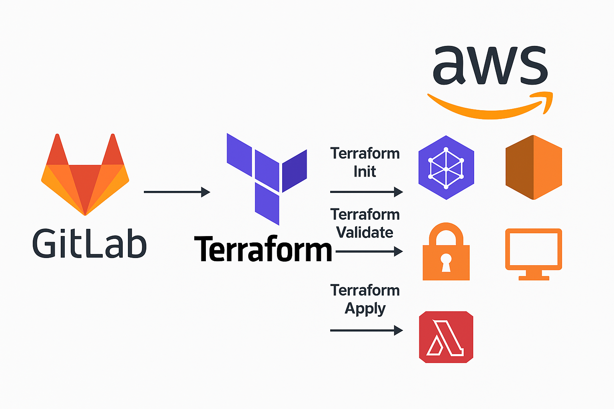

# AWS Terraform Deployment Automation with GitLab CI/CD  

## Project Overview  

This project demonstrates how to automate infrastructure deployment to AWS using Terraform and GitLab CI/CD pipelines.  

This project was inspired and guided by the YouTube tutorial from [DevOpsJourney](https://www.youtube.com/watch?v=oqOzM_WBqZc&t=2822s).  

---

## Objectives  

- Automate AWS infrastructure provisioning using Terraform  
- Implement CI/CD pipelines with GitLab for infrastructure deployment  
- Use Infrastructure as Code (IaC) best practices  
- Securely manage AWS credentials using GitLab environment variables  

---

## Technologies Used  

| Tool/Technology | Purpose |  
|-----------------|---------|  
| Terraform       | Infrastructure as Code for AWS resources |  
| GitLab CI/CD    | Automating deployment pipelines |  
| AWS             | Cloud Infrastructure |  
| Git             | Version Control |  

---

## Architecture Diagram  

  


## Pipeline Workflow  

```bash
1. Developer pushes code to GitLab repository  
2. GitLab triggers the CI/CD Pipeline  
3. Pipeline stages:  
   - Terraform Init  
   - Terraform Validate  
   - Terraform Plan  
   - Terraform Apply (Manual or Auto Approval)  
4. AWS Infrastructure is Provisioned Automatically  
